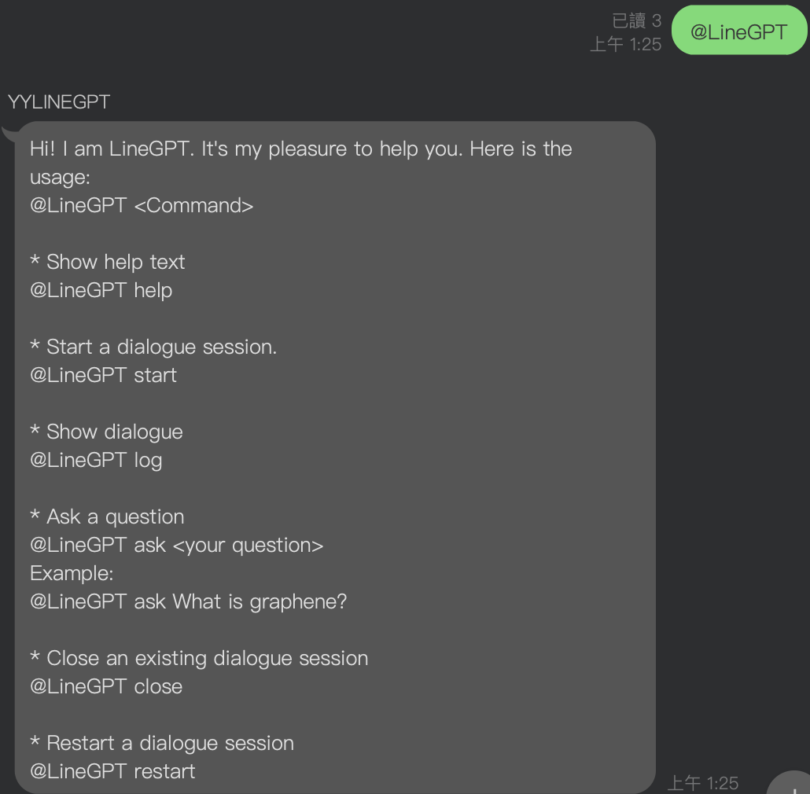
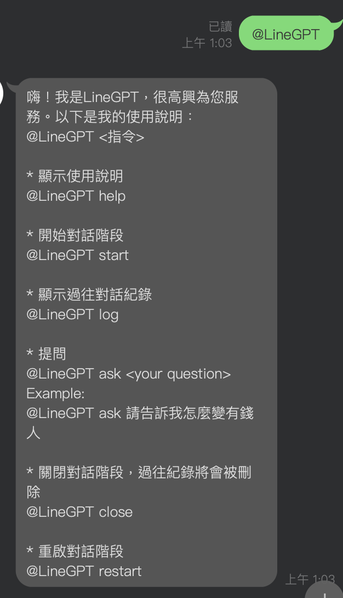

# LineGPT
Add a ChatGPT linebot in your group as your group's assistant. 
<div align="center">
  
  
</div>

# Open Server
```
uvicorn api.index:app --reload
```

# Api Page
http://127.0.0.1:8000/docs

# Usage
## Environment variable
Settings are listed in a .env file. Here offering a template '.env.template' for user to setup your personal setting for this bot.<br>
You need LINE_CHANNEL_SECRET, LINE_CHANNEL_ACCESS_TOKEN, OPENAI_API_KEY to start. <br>
For LINE_CHANNEL_SECRET and LINE_CHANNEL_ACCESS_TOKEN, you need a linebot first. Please refer to https://developers.line.biz/en/services/messaging-api/ (en) or https://developers.line.biz/zh-hant/services/messaging-api/ (en) for creating a linebot. <br>
For OPENAI_API_KEY, you can go to https://platform.openai.com/account/api-keys to see how to get an api key.

After you fill in these variable, please rename the .env.template to .env.
