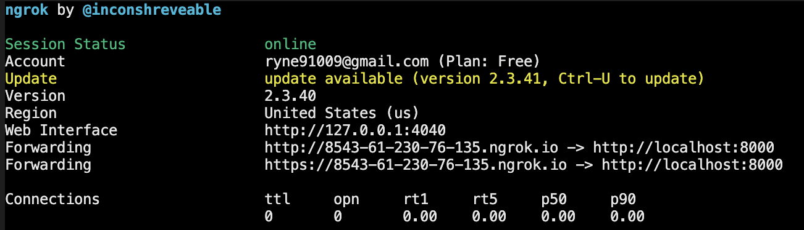

# LineGPT

[中文](README_zh_TW.md) | English

A linebot with assistance of ChatGPT.

## Usage

The functions of LineGPT are defined by several commands. You can use help to list available commands. <br>

```
@LineGPT help
```

## ChatGPT

Let ChatGPT help you.

```
@LineGPT gpt help
```

## Weather (Currently only support weather in Taiwan)

Check the weather in your place.

```
@LineGPT weather help
```


## Settle

Need to know how much you should pay? Let LineGPT settle a groups' expense!

```
@LineGPT settle help
```


## Developer's guide

### Environment variable

Settings are listed in a .env file. Here offering a template '.env.template' for user to setup your personal setting for this bot.<br>
| Item | Necessity | Default value | Note |
| ------------------------- | :-------------------------------------------------------------------------: | :------------: | ------------------------------------------------------------------------------------------------------------------------------------------------------------------------------------------------------------------------------------------------------------------------------------ |
| LANGUAGE | NO | zh_TW | Default is Traditional Chinese. |
| LINE_CHANNEL_SECRET | YES | "" | Channel secret of LINE. You can check [this link](https://developers.line.biz/en/services/messaging-api/) for more information |
| LINE_CHANNEL_ACCESS_TOKEN | YES | "" | Channel access token of LINE. You can check [this link](https://developers.line.biz/en/services/messaging-api/) for more information |
| OPEN_AI_KEY | Perhaps. You still can use commands except for 'gpt' if this item is empty. | "" | Please check [this link](https://platform.openai.com/account/api-keys) to see how to get an api key. |
| OPEN_AI_MODEL | NO | text-curie-001 | The model which will be used in ChatGPT. You can refer to [official documentation](https://platform.openai.com/docs/models/gpt-3) for more information. |
| OPENAI_TEMPERATURE | NO | 0.9 | Between 0 and 2. Higher values like 0.8 will make the output more random, while lower values like 0.2 will make it more focused and deterministic. More information: [temperature](https://platform.openai.com/docs/api-reference/completions/create#completions/create-temperature) |
| OPENAI_MAX_TOKEN | NO | 150 | The maximum number of tokens to generate in the completion. More information: [max_tokens](https://platform.openai.com/docs/api-reference/completions/create#completions/create-max_tokens) |
| OPENAI_PRESENCE_PENALTY | NO | 0.6 | Between -2.0 and 2.0. Positive values increase the model's likelihood to talk about new topics. More information: [presence_penalty](https://platform.openai.com/docs/api-reference/completions/create#completions/create-presence_penalty) |
| OPEN_FREQUENCY_PENALTY | NO | 0.0 | Between -2.0 and 2.0. Positive values decrease the model's likelihood to repeat the same line verbatim. More information: [frequency_penalty](https://platform.openai.com/docs/api-reference/completions/create#completions/create-frequency_penalty) |
| SESSION_EXPIRE | NO | 600 | To save the memory, you can not talk to ChatGPT after <SESSION_EXPIRE> time since last update. |
| WEATHER_TOKEN | NO | "" | You can set your own token or simply use mine. If you want to use your own token. Please refer the [official website](https://opendata.cwb.gov.tw/devManual/insrtuction) to see how to get a token. |

Note: After you fill in these variable, please rename the .env.template to .env.

### Testing

1. Start the server

```
uvicorn api.index:app --reload
```

api page will be
http://127.0.0.1:8000/docs

2. Open ngrok

```
ngrok http 8000
```



3. Copy the https url to line bot webhook url. The result will be <your url>/webhook
   

4. Check verify button to see if the url works.
5. You can send message to your bot.

### Deploy

1. Vercel
   Fork this project to your github to use vercel. You can import the .env file in Settings > Environment Variables.

2. Container
   You can also deploy your bot by docker. Note that Linebot only take https url, so you may need to verify your domain first.

### Issues, questions and PRs

Bug reports, issues, and PRs are always welcome. If you face any questions, welcome to [discuss page](https://github.com/YYLIZH/LineGPT/discussions) to discuss.
