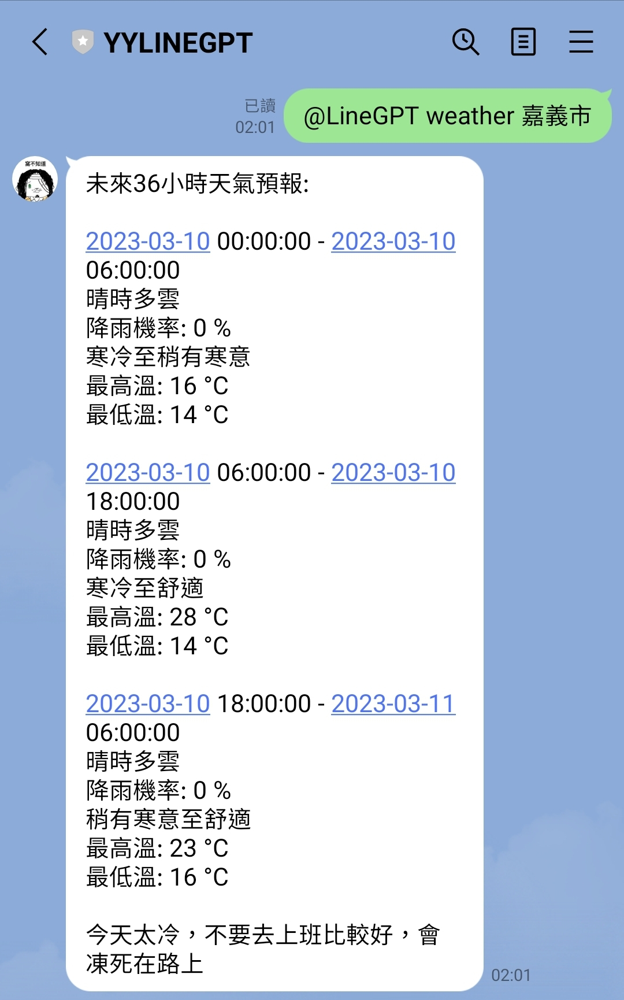

# LineGPT

中文 | [English](README.md)

加入了 ChatGPT 的 LINE 機器人

## 使用說明

LineGPT 採用指令控制，在輸入筐輸入相關指令即可使用。
<br>
可以用 help 指令查詢目前支援的全部指令。

```
@LineGPT help
```


## ChatGPT

讓 ChatGPT 幫助你。

```
@LineGPT gpt help
```


## Weather (目前只支援Taiwan天氣)

查詢你所在位置的天氣情報。

```
@LineGPT weather help
```


## Settle

跟朋友出遊，卻永遠不知道誰該付多少錢嗎？讓 LineGPT 幫你算好！

```
@LineGPT settle help
```

## Developer's guide

### 環境變數

需要 .env 這個檔案用做設定檔，此專案提供 .env.template 讓使用者做修改。以下是相關設定。<br>
| Item                      | 必需  | 預設值 | Note                                                                                                                                                           |
| ------------------------- | :---: | :----: | -------------------------------------------------------------------------------------------------------------------------------------------------------------- |
| LANGUAGE                  |  NO   | zh_TW  | 繁體中文                                                                                                                                                       |
| LINE_CHANNEL_SECRET       |  YES  |   ""   | Channel secret of LINE. You can check [this link](https://developers.line.biz/en/services/messaging-api/) for more information                                 |
| LINE_CHANNEL_ACCESS_TOKEN |  YES  |   ""   | Channel access token of LINE. You can check [this link](https://developers.line.biz/en/services/messaging-api/) for more information                           |
| SESSION_EXPIRE            |  NO   |  600   | 單位是秒。為了節省記憶體, 在最後一次與ChatGPT對話之後就會開始計時，<SESSION_EXPIRE>之後就不能基於之前的對話繼續對話，必須重新開啟對話階段。                    |
| WEATHER_TOKEN             |  NO   |   ""   | 可以不用額外設計，會使用我自己的token。如果你真的很想自己弄一個的話，可以按照[官方文件](https://opendata.cwb.gov.tw/devManual/insrtuction) 查詢如何獲取token。 |

注意：填完.env.template之後，需要把此檔案更名成.env 才會完成設置。

### 測試

1. 開啟fastapi server

```
uvicorn api.index:app --reload --loop asyncio
```

api page will be
http://127.0.0.1:8000/docs

2. ngrok

```
ngrok http 8000
```


3. Copy the https url to line bot webhook url. The result will be <your url>/webhook
   

4. Check verify button to see if the url works.
5. You can send message to your bot.

### Deploy

1. Vercel
   Fork this project to your github to use vercel. You can import the .env file in Settings > Environment Variables.

2. Container
   You can also deploy your bot by docker. Note that Linebot only take https url, so you may need to verify your domain first.

### Issues, questions and PRs

Bug reports, issues, and PRs are always welcome. If you face any questions, welcome to [discuss page](https://github.com/YYLIZH/LineGPT/discussions) to discuss.
